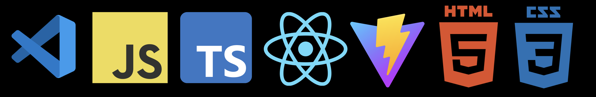
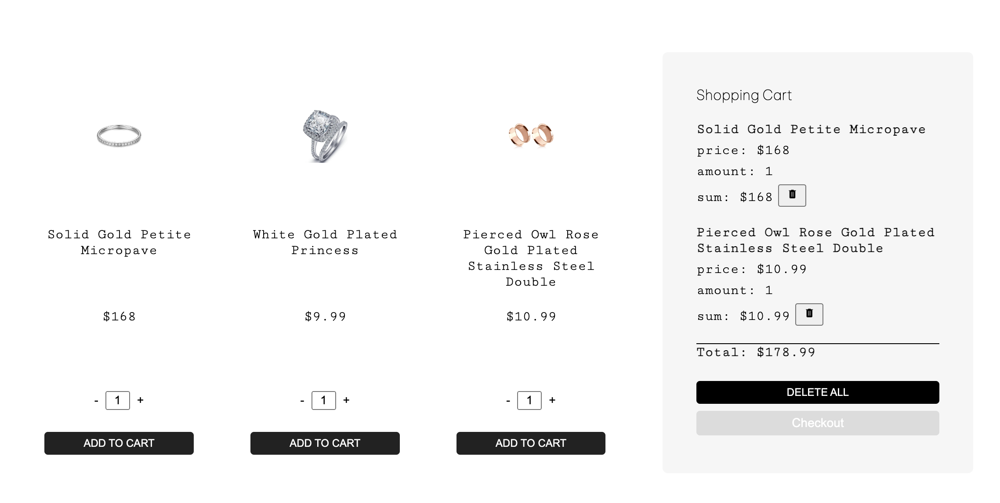
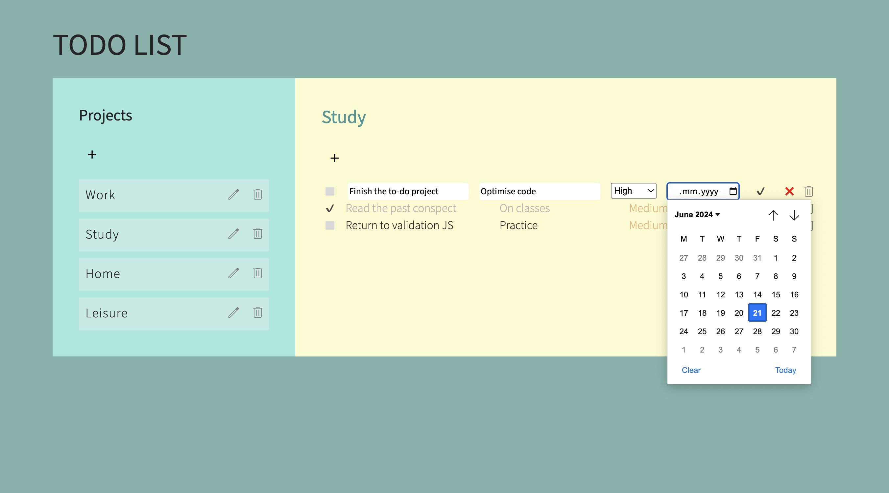

# Hey there! 👋

My name is Marina and now I’m learning JavaScript through self-study by using the [Odin](https://www.theodinproject.com/) curriculum, [Udemy](https://www.udemy.com/) React course, and getting feedback from my mentor. I have practical experience in JavaScript, a bit of TypeScript, CSS, HTML, HTML DOM, and React framework. I aim to deepen my skills in frontend development and to introduce myself to backend development in the nearest future.

## 🔧 Technologies and tools I use:

## 📑 My demo projects:

### Shopping Cart

React + Vite application. An online jewerly shop simulator. The products are fetched from the [fakestoreapi.com](https://fakestoreapi.com/docs). Based on the final task from the [Odin](https://www.theodinproject.com/) frontend curriculum.

[Live version](https://mountaiflockshoppingcart.netlify.app)

[Repository](https://github.com/mountainflock/shopping_cart)

### Programming Exercises

Programming assignments I did when I took my first steps in learning to code. Here you can find many different small programs, ranging from simple algorithms to things like tic-tac-toe with a computer opponent and a Wordle-type game.

[Basics](https://github.com/mountainflock/ts_exercises)

[Odin Computer Science](https://github.com/mountainflock/cs_exercises)

### ToDo List

JavaScript web application for organizing task lists. This project is part of the [Odin](https://www.theodinproject.com/) curriculum, summing up several JavaScript topics.

[Live version](https://mountainflockstodolistjs.netlify.app)

[Repository](https://github.com/mountainflock/todo_list)

### CV application

React + Vite application where users can input their information and generate a CV/résumé. This project is part of the [Odin](https://www.theodinproject.com/) React course, demonstrating basic React concepts. Written in TypeScript.

[Live version](https://mountainflockscv.netlify.app)

[Repository](https://github.com/mountainflock/cv_application)

### Memory Card

React + Vite application, a memory game. This project is part of the [Odin](https://www.theodinproject.com/) React course, demonstrating basic React concepts.

[Repository](https://github.com/mountainflock/memory_card)

